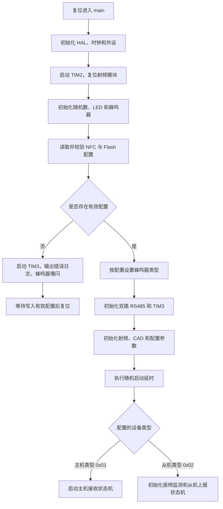
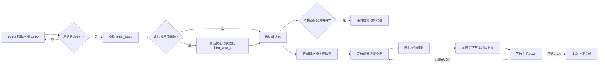

# BUS_SEAT_V0_0_3

基于 STM32F103CB 的客车座椅安全带监测固件。同一份固件同时支持主机和从机，设备在启动时读取 NFC 配置，根据配置帧中的设备类型自动选择运行角色。

- 从机：采集两个座椅的占座和安全带信号，完成滤波、状态转移判断与蜂鸣器告警，通过 LoRa 主动上报。
- 主机：接收从机 LoRa 上报，校验车辆号与数据格式，回复 ACK，并通过 RS485 将座椅状态发送给上位机。
- 配置：手机通过 ST25DV NFC EEPROM 写入配置；固件同时在片内 Flash 保存有效配置，并按时间戳选择较新的版本。

## 硬件与开发环境

| 项目 | 说明 |
| --- | --- |
| MCU | STM32F103CB，Cortex-M3，128 KB Flash，20 KB RAM |
| 系统时钟 | 72 MHz，外部高速晶振 + PLL |
| 无线 | PAN3029/E290 LoRa，SPI1 通信 |
| NFC | ST25DV，通过自定义总线接口访问 |
| 有线通信 | USART1、USART2，两路 RS485，DMA 收发 |
| USB | USB FS CDC 虚拟串口 |
| 定时器 | TIM2 微秒计时；TIM3 10 Hz 系统任务；TIM4 PWM |
| 工程工具 | Keil MDK-ARM，ARM Compiler 5.06 update 6 |
| Device Pack | Keil STM32F1xx DFP 2.4.1 |

Keil 工程文件为 `MDK-ARM/BUS_SEAT_V0_0_3.uvprojx`，STM32CubeMX 配置文件为 `BUS_SEAT_V0_0_3.ioc`。

## 目录结构

```text
BUS_SEAT_V0_0_3/
├─ Core/
│  ├─ Inc/                         STM32CubeMX 生成的外设头文件
│  └─ Src/                         main、时钟、GPIO、DMA、SPI、UART、定时器等
├─ Drivers/
│  ├─ CMSIS/                       Cortex-M 与 STM32F1 设备支持
│  ├─ STM32F1xx_HAL_Driver/        STM32 HAL 驱动
│  └─ BSP/Components/ST25DV/       ST25DV 芯片驱动
├─ MDK-ARM/
│  ├─ BUS_SEAT_V0_0_3.uvprojx      Keil 工程
│  ├─ PAN_Driver/                  PAN3029 射频底层驱动
│  └─ User/                        本项目的主要业务代码
├─ Middlewares/
│  ├─ ST/lib_nfc/                  NFC/NDEF 中间件
│  └─ ST/STM32_USB_Device_Library/ USB Device 与 CDC 中间件
├─ NFC/                            ST25DV 板级适配和 NDEF 配置
├─ USB_DEVICE/                     USB CDC 应用层、描述符和底层适配
├─ doc/                            配置协议、通信协议和辅助资料
└─ tools/                          CH340、DAPLink 自动烧录脚本
```

`MDK-ARM/BUS_SEAT_V0_0_3/` 是 Keil 编译输出目录，已在 `.gitignore` 中忽略。链接脚本 `BUS_SEAT_V0_0_3.sct` 保留在该目录中。

## 主要业务模块

| 模块 | 作用 |
| --- | --- |
| `Core/Src/main.c` | 系统入口、外设初始化、角色分支和主循环 |
| `MDK-ARM/User/app_st25dv.c` | NFC 初始化、配置帧校验、主从角色识别、NFC/Flash 配置同步 |
| `MDK-ARM/User/flash_storage.c` | 使用两个 Flash 页保存配置，支持记录校验、追加和换页 |
| `MDK-ARM/User/seat_belt_monitor.c` | 两路座椅采样、状态机、滤波、异常判断、告警和上报快照 |
| `MDK-ARM/User/bus_slave_report.c` | 从机信道检测、随机退避、LoRa 发送、ACK 等待和超时重试 |
| `MDK-ARM/User/bus_master_report.c` | 主机接收校验、重复包处理、RS485 转发和 ACK 回复 |
| `MDK-ARM/User/rs485bsp.c` | 两路 RS485 的 DMA 收发队列、端口转发、日志和上位机帧输出 |
| `MDK-ARM/User/buzzer_led_drv.c` | 红绿 LED 与有源/无源蜂鸣器驱动，支持常亮和快慢闪烁 |
| `MDK-ARM/User/bus_rand.c` | 从机竞争时隙和周期上报使用的随机数 |
| `MDK-ARM/PAN_Driver/pan_rf.c` | PAN3029 初始化、参数设置、CAD、收发和 IRQ 状态处理 |
| `USB_DEVICE/App/usbd_cdc_if.c` | USB CDC 虚拟串口接口；当前接收回调只重新挂载接收缓冲区 |

仓库中还保留了早期的 `bus_master.c`、`bus_slave.c` 等模块，当前 `main.c` 使用的是 `bus_master_report.c` 和 `bus_slave_report.c` 这套主动上报流程。

## 启动流程



### 配置加载

`APP_pragma_init()` 分别读取片内 Flash 和 ST25DV EEPROM：

1. 检查帧头、设备类型和 CRC32。
2. 检查 RF、车辆号、RS485、座椅及竞争参数是否合法。
3. 两边都有效时比较 `unix_time`，使用时间戳较新的配置。
4. 将较新的有效配置同步到另一种存储介质。
5. `type = 0x01` 时设置为主机，`type = 0x02` 时设置为从机。

运行期间，TIM3 每 100 ms 调用 `nfc_task_in_tim()`。检测到 ST25DV 写入事件且新帧有效后，设备执行软件复位，重新加载配置并切换到相应角色。

如果 Flash 与 NFC 中都没有有效配置，程序进入配置错误状态，输出 `No valid config!!!`，蜂鸣器慢闪。写入有效 NFC 配置后会触发复位并恢复运行。

## 从机执行流程

从机初始化 `SeatBeltMonitor` 后，以 10 Hz 采样两个座椅端口。每个座椅由占座信号和安全带信号组成一个两位状态：

| 状态 | 含义 |
| --- | --- |
| `00` | 无人、未扣安全带 |
| `01` | 有人、未扣安全带 |
| `10` | 无人、已扣安全带 |
| `11` | 有人、已扣安全带 |

稳定状态发生变化时，模块把状态转换成 `order_state` 1～12。配置可指定哪些转换需要滤波、哪些属于异常，以及报警延时和持续时间。通过滤波的状态转换会生成一份包含两个座椅当前状态的最新快照。



从机 LoRa 上报帧固定为 7 字节：

```text
vehicle_id | seq_l | seq_h | seat0_no | seat0_order | seat1_no | seat1_order
```

状态机为：

```text
IDLE
  -> WAIT_CHANNEL_IDLE
  -> WAIT_CONTEND_SLOT
  -> SEND
  -> WAIT_TX_DONE
  -> WAIT_ACK
  -> IDLE 或重新竞争发送
```

发送前如果产生了新的座椅事件，待发送内容会更新为最新快照。ACK 超时后按 NFC 配置的 `max_retry` 重试，值为 `255` 时持续重试。配置还可启用周期同步上报，周期为 `reserved[1] × 8 秒 + 0～reserved[2] 秒随机延迟`。

## 主机执行流程

主机始终保持 LoRa 接收。收到 7 字节从机上报后：

1. 校验帧长度、`vehicle_id`、座椅号和 `order_state`。
2. 在 30 秒窗口内识别内容完全相同的重复包。
3. 新数据通过配置了 `RS485_FEATURE_JSON_OUT` 的 RS485 端口发送给上位机。
4. 无论新包还是重复包，都回复 3 字节 ACK，防止从机继续重试。
5. ACK 发送完成后重新进入连续接收。

ACK 格式为：

```text
vehicle_id | seq_l | seq_h
```

主机向上位机输出的是紧凑二进制帧：

```text
0xAA | seat_count | seat_no/order_state ... | checksum
```

`checksum` 为前面所有字节累加和的低 8 位。完整配置帧、12 种状态转换和 RS485 帧定义见 [`doc/nfc_config_and_rs_485_protocol_spec.md`](doc/nfc_config_and_rs_485_protocol_spec.md)。

## 定时与中断协作

程序没有使用 RTOS，业务由主循环轮询、定时器中断和 HAL 回调共同驱动。

- 主循环持续调用 `rf_irq_process()`，把射频芯片 IRQ 转换为接收完成、发送完成、CRC 错误和超时标志。
- 主机或从机的 report task 在主循环中读取这些标志并推进通信状态机。
- TIM3 每 100 ms 调用 NFC 任务、LED/蜂鸣器节拍和座椅监测任务。
- USART1/USART2 使用 DMA 与 Receive-to-Idle；发送完成、接收事件和错误回调负责队列续传与接收恢复。
- USB 低优先级中断交给 HAL PCD 和 USB Device CDC 协议栈处理。

TIM3 回调中的任务应保持短小，耗时处理应放在主循环中，以免影响射频和串口响应。

## RS485 功能

每个 RS485 端口通过 NFC 配置一个功能位掩码，可组合使用：

| 标志 | 值 | 功能 |
| --- | ---: | --- |
| `RS485_FEATURE_JSON_OUT` | `0x01` | 输出上位机座椅二进制帧；宏名为历史命名 |
| `RS485_FEATURE_FORWARD_TO_OTHER` | `0x02` | 把本端口收到的数据转发到另一个端口 |
| `RS485_FEATURE_LOG_OUT` | `0x04` | 输出固件诊断日志 |

两路端口都有独立的 DMA 发送队列和状态统计。配置还可分别指定波特率索引。

## 编译

1. 安装 Keil MDK-ARM，并安装 `Keil.STM32F1xx_DFP.2.4.1` Device Pack。
2. 确认已安装 ARM Compiler 5；工程当前使用 5.06 update 6。
3. 打开 `MDK-ARM/BUS_SEAT_V0_0_3.uvprojx`。
4. 选择目标 `BUS_SEAT_V0_0_3`，执行 Build 或 Rebuild。
5. 生成文件位于 `MDK-ARM/BUS_SEAT_V0_0_3/`，其中烧录固件为 `BUS_SEAT_V0_0_3.hex`。

编译输出目录已被 Git 忽略，重新编译不会把 `.o`、`.crf`、`.map`、`.axf`、`.hex` 等中间文件加入版本库。

## 烧录

可直接使用 Keil 下载，也可使用 `tools/` 中的量产脚本。

DAPLink/CMSIS-DAP：

```powershell
python -m pip install -r tools/requirements.txt
python tools/daplink_auto_flash.py once "MDK-ARM/BUS_SEAT_V0_0_3/BUS_SEAT_V0_0_3.hex" --include-existing
```

CH340 + STM32CubeProgrammer：

```powershell
python -m pip install -r tools/requirements.txt
python tools/auto_flash.py once "MDK-ARM/BUS_SEAT_V0_0_3/BUS_SEAT_V0_0_3.hex" --include-existing
```

量产连续烧录、接线和排障参数见：

- [`tools/DAPLink自动烧录说明.md`](tools/DAPLink自动烧录说明.md)
- [`tools/自动烧录说明.md`](tools/自动烧录说明.md)

## 配置注意事项

- NFC 配置从 ST25DV EEPROM 地址 `0x0000` 开始写入。
- 主机完整配置帧为 39 字节，从机完整配置帧为 52 字节。
- 多字节字段使用小端格式，payload 使用 1 字节紧凑对齐。
- CRC32 覆盖帧头、时间戳、类型和 payload，不包含 CRC 字段本身。
- 主机与从机必须使用相同的车辆号和兼容的 LoRa 参数。
- 从机只使用一个座椅端口时，另一个端口应配置为 `enable = 0, seat_no = 0`。
- 每次生成新配置时应更新 `unix_time`，否则旧的 Flash 配置可能优先于 NFC 内容。
